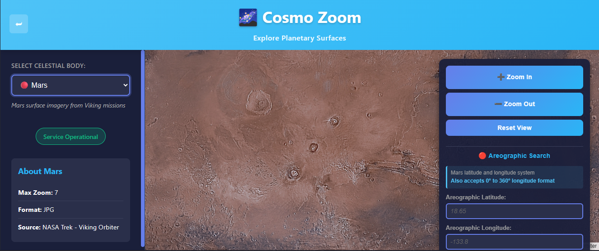

# 🌌 Cosmozoom Frontend

Welcome to **Cosmozoom** — a web-based planetary mapping tool inspired by Google Maps, but designed for space enthusiasts, scientists, and explorers. Cosmozoom lets you visually explore high-resolution surfaces of **Earth**, **Mars**, **Mercury**, and the **Moon**, powered by NASA's open data and rendered beautifully with Leaflet.

  
*Mars surface tiles from NASA Viking Missions via Trek WMTS*

---

## 🚀 Key Features

- 🪐 Explore multiple celestial bodies with rich detail
- 🛰️ NASA WMTS and Trek API integration for planetary tiles
- 🧭 Intuitive controls: zoom, pan, coordinate search
- 🗺️ Built with Leaflet.js for smooth, interactive maps
- 🔌 Supports aerographic coordinate input
- 🔄 Easily extendable for future bodies and data sources

---

## 📦 Tech Stack

- **React** + **Vite** – blazing-fast frontend
- **Leaflet.js** – interactive map rendering
- **Axios** – API communication
- **NASA Trek WMTS API** – planetary tile data
- **Google Jeep Services** – tile fetching
- **Custom Service Layer** – pluggable tile services and search logic

---

## 📁 Project Structure

```bash
cosmozoom/
├── public/                # Static assets
├── src/
│   ├── components/        # Reusable UI components (Dropdown, MapControls, etc.)
│   ├── pages/             # Main map viewer and views
│   ├── services/
│   │   └── api.js         # 🔧 Configure base backend API URL here
│   └── App.js             # Main app entry
├── .env                   # Optional env variables
└── package.json           # Project config
